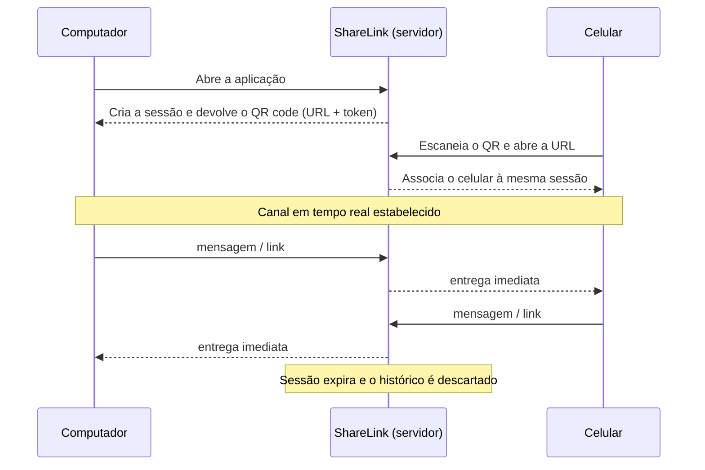

# ShareLink

Canal de comunicação bidirecional e **efêmero** entre o computador e o celular, pareados por QR code.

## O que é

Quase sempre a necessidade é a mesma: passar um link, um trecho de texto ou um código do PC para o celular (ou o contrário) sem recorrer a WhatsApp, e-mail para si mesmo ou cabo USB.

O ShareLink resolve isso com um mini-chat temporário:

1. Você abre a aplicação no computador.
2. A aplicação cria uma sessão e mostra um QR code.
3. Você aponta a câmera do celular e abre o link.
4. Os dois dispositivos passam a trocar mensagens em tempo real, nos dois sentidos.
5. Quando a sessão é fechada (ou expira), o histórico é descartado — nada fica salvo.

## Fluxo



## Estado atual

> ⚠️ Projeto em estágio inicial. Hoje existe apenas o esqueleto de uma aplicação ASP.NET Core Minimal API (`dotnet new web`) respondendo `Hello World!` na raiz. As seções abaixo descrevem como rodar esse esqueleto e o rumo pretendido.

| Etapa | Situação |
| --- | --- |
| Esqueleto web (Minimal API, `net10.0`) | ✅ pronto |
| Criação de sessão e geração do QR code | ⬜ pendente |
| Canal em tempo real entre os dois dispositivos | ⬜ pendente |
| Interface do computador e do celular | ⬜ pendente |
| Expiração automática da sessão | ⬜ pendente |
| Envio de arquivos e imagens | ⬜ a avaliar |

## Requisitos

- [.NET SDK 10.0](https://dotnet.microsoft.com/download) — o projeto tem como alvo `net10.0`.

```bash
dotnet --version
```

## Como executar

```bash
dotnet run
```

Ou, com recarga automática a cada alteração:

```bash
dotnet watch run
```

Endereços de desenvolvimento (definidos em [launchSettings.json](Properties/launchSettings.json)):

- HTTP — `http://localhost:5012`
- HTTPS — `https://localhost:7012`

No VS Code também existem as tasks `build`, `publish` e `watch`, além do perfil de depuração *.NET Core Launch (web)*.

## Acessando pelo celular

Para o QR code servir a algo, o celular precisa alcançar o servidor.

**Mesma rede Wi-Fi** — publique em todas as interfaces e use o IP da máquina:

```bash
dotnet run --urls "http://0.0.0.0:5012"
```

Descubra o IP com `ipconfig` (Windows) ou `ip addr` (Linux/macOS). O QR code precisa apontar para `http://<IP-DA-MÁQUINA>:5012/...` — nunca para `localhost`, que no celular significa o próprio celular. Pode ser necessário liberar a porta no firewall do Windows.

**Fora da mesma rede** — use um túnel (Dev Tunnels, ngrok, Cloudflare Tunnel) e guarde a URL pública em `appsettings.Local.json`, que já está no `.gitignore`.

Vale lembrar que recursos como câmera e área de transferência só ficam disponíveis no navegador sob HTTPS ou `localhost`; se a página do celular for usar a câmera, prefira HTTPS ou túnel.

## Estrutura

```
share-link/
├─ .vscode/                     # tasks e configurações de depuração
├─ Properties/
│  └─ launchSettings.json       # perfis e portas de desenvolvimento
├─ Program.cs                   # ponto de entrada (Minimal API)
├─ ShareLink.csproj             # projeto (net10.0)
├─ appsettings.json             # configuração da aplicação
└─ .gitignore
```

## Direção técnica

Decisões ainda em aberto, registradas aqui para orientar os próximos passos:

- **Tempo real** — SignalR é o caminho natural em ASP.NET Core (WebSockets com fallback automático e reconexão pronta); WebSockets puros bastam se a ideia for manter o mínimo de dependências.
- **QR code** — geração no servidor (por exemplo, com QRCoder, devolvendo PNG ou SVG) ou no próprio navegador via JavaScript.
- **Sessões** — armazenamento em memória com TTL curto (`IMemoryCache` ou um dicionário concorrente). Enquanto o chat for efêmero, não há motivo para banco de dados.
- **Pareamento** — o token da sessão viaja na URL do QR code; limitar a sessão a dois participantes e invalidar o token após o pareamento evita que um terceiro entre com o mesmo link.

## Segurança e privacidade

Quem tiver o link da sessão entra nela: trate o QR code como uma senha temporária e não o exponha em tela compartilhada ou em prints. As mensagens não são persistidas — vivem apenas enquanto a sessão existir.

## Licença

A definir.
