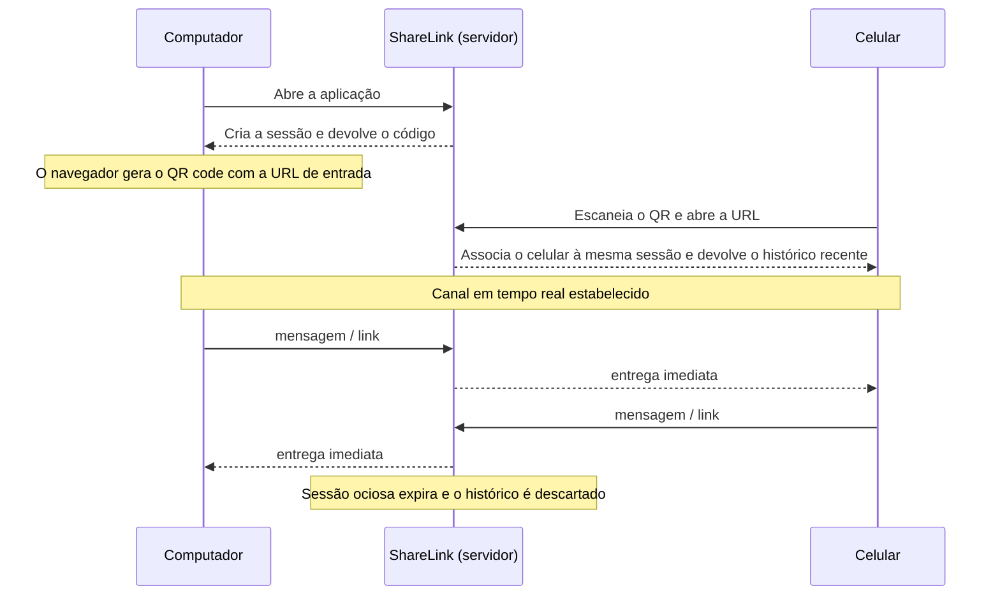

# ShareLink

Canal de comunicação bidirecional e **efêmero** entre o computador e o celular, pareados por QR code.

## O que é

Quase sempre a necessidade é a mesma: passar um link, um trecho de texto ou um código do PC para o celular (ou o contrário) sem recorrer a WhatsApp, e-mail para si mesmo ou cabo USB.

O ShareLink resolve isso com um mini-chat temporário:

1. Você abre a aplicação no computador.
2. A aplicação cria uma sessão e mostra um QR code.
3. Você aponta a câmera do celular e abre o link.
4. Os dois dispositivos passam a trocar mensagens em tempo real, nos dois sentidos.
5. Quando a sessão expira por inatividade, o histórico é descartado — nada fica salvo.

## Fluxo



## Como funciona por dentro

- **ASP.NET Core Minimal API** com **SignalR**. O Group do SignalR nomeado com o código da sessão é o canal de entrega.
- Como Groups do SignalR **não podem ser consultados** — não há API para perguntar se um grupo existe ou quem está nele —, um `SessionStore` em memória é a fonte de verdade sobre códigos válidos, participantes e última atividade.
- O código de sessão tem 6 caracteres sorteados com `RandomNumberGenerator`, num alfabeto sem `0`, `O`, `1` e `I`, para poder ser digitado à mão quando a câmera falha.
- Cada sessão guarda as **últimas 50 mensagens**, reenviadas a quem entra e a quem reconecta.
- Ao entrar, o participante recebe um **token**. Reconectar cria uma conexão nova, que pode chegar antes de o servidor perceber a queda da anterior; o token é o que permite retomar o próprio lugar sem esbarrar na conexão morta, e sem afrouxar a recusa a um terceiro aparelho.
- Nada é gravado em disco. Reiniciar o processo derruba todas as sessões.

## Requisitos

[.NET SDK 10.0](https://dotnet.microsoft.com/download) — o projeto tem como alvo `net10.0`. SignalR vem no framework compartilhado, não há pacote a instalar.

## Executar localmente

```bash
dotnet run
```

Ou, com recarga automática a cada alteração:

```bash
dotnet watch run
```

Endereços de desenvolvimento (em [launchSettings.json](Properties/launchSettings.json)): `http://localhost:5012` e `https://localhost:7012`. No VS Code também existem as tasks `build`, `publish` e `watch`.

## Usar com o celular na rede local

```bash
dotnet run --urls "http://0.0.0.0:5012"
```

No computador, **abra a aplicação pelo IP da máquina, não por `localhost`**:

```
http://<IP-DA-MAQUINA>:5012/
```

O QR code é montado a partir do endereço da página aberta. Abrindo por `localhost`, o QR carrega `localhost` — que no celular significa o próprio celular, e o pareamento falha sem explicação aparente. Descubra o IP com `ipconfig` (Windows) ou `ip addr` (Linux/macOS); na primeira execução o firewall deve pedir liberação da porta.

## Configuração

Seção `ShareLink` do [appsettings.json](appsettings.json). Qualquer chave pode ser sobrescrita na linha de comando, por exemplo `--ShareLink:SessionTimeoutMinutes=0.5`.

| Chave | Padrão | O que faz |
| --- | --- | --- |
| `SessionTimeoutMinutes` | `30` | Inatividade que encerra a sessão. Janela **deslizante**: conversar renova. Aceita fração de minuto. |
| `MaxMessagesPerSession` | `50` | Mensagens guardadas para reenviar a quem entra ou reconecta. |
| `MaxMessageLength` | `2000` | Limite de caracteres por mensagem. |
| `MaxGuestsPerSession` | `1` | Convidados simultâneos. O servidor aceita mais; a interface é escrita para dois participantes. |
| `CleanupIntervalSeconds` | `60` | Intervalo entre varreduras de sessões expiradas. |

Há ainda um limitador de requisições por IP, fixo no código: 20 consultas de código e 10 criações de sessão por minuto. É o que torna inviável varrer o espaço de códigos de 6 caracteres. O hub e os arquivos estáticos ficam fora do limitador.

## Publicar atrás do nginx

A aplicação funciona em subcaminho sem configuração especial: nenhuma URL do front-end começa com `/`, todas são resolvidas a partir do endereço da página. O que ela precisa é confiar nos headers do proxy, o que já está no pipeline via `UseForwardedHeaders` em [Program.cs](Program.cs) — a lista de proxies confiáveis fica no padrão, que cobre o nginx em loopback.

O exemplo abaixo publica a aplicação em `/share-link/`. A configuração real desta instalação fica em `private/`, fora do versionamento.

No **contexto `http`**, fora do `server`:

```nginx
map $http_upgrade $connection_upgrade {
    default upgrade;
    ''      close;
}

map $http_x_forwarded_proto $forwarded_proto {
    default $http_x_forwarded_proto;
    ''      $scheme;
}
```

Dentro do `server`:

```nginx
location = /share-link {
    return 301 /share-link/;
}

location /share-link/ {
    proxy_pass http://127.0.0.1:5012/;

    proxy_http_version 1.1;
    proxy_set_header Upgrade    $http_upgrade;
    proxy_set_header Connection $connection_upgrade;

    proxy_set_header Host               $host;
    proxy_set_header X-Real-IP          $remote_addr;
    proxy_set_header X-Forwarded-For    $proxy_add_x_forwarded_for;
    proxy_set_header X-Forwarded-Proto  $forwarded_proto;
    proxy_set_header X-Forwarded-Prefix /share-link;

    proxy_read_timeout 300s;

    client_max_body_size 40m;
    proxy_request_buffering off;
}
```

Por que cada peça importa:

- **A barra final em `proxy_pass`** remove o prefixo antes de repassar, então a aplicação recebe `/api/sessions` e `/hub/session`. Sem ela seria preciso um `UsePathBase` no código.
- **O redirect de `/share-link` para `/share-link/`** não é cosmético: sem a barra, o navegador resolve os caminhos relativos um nível acima e o QR sairia apontando para fora da aplicação.
- **`Connection` pelo `map`** em vez de `"upgrade"` fixo. Fixo, toda requisição comum — inclusive o long polling, para o qual o SignalR cai quando o WebSocket não passa — carrega um pedido de upgrade que não existe.
- **`X-Forwarded-Proto` pelo `map`**. Usar `$http_x_forwarded_proto` direto envia o header **vazio** quando não há outro proxy na frente, e a aplicação continua enxergando `http`. Com o `map`, o valor cai para `$scheme` nesse caso e o repasse continua correto se um dia houver um proxy à frente.
- **`proxy_read_timeout`** com folga. O SignalR envia keep-alive a cada 15 segundos, então os 60s padrão do nginx até sobrevivem; a folga evita quedas espúrias em rede ruim.
- **`client_max_body_size`** acima do teto de arquivo. O padrão do nginx é **1 MB**: sem esta linha, um envio pelo servidor morre com 413 antes de chegar à aplicação, e o corpo da resposta é a página de erro do nginx, não a mensagem da aplicação.
- **`proxy_request_buffering off`** faz o arquivo fluir para a aplicação em vez de o nginx gravá-lo inteiro num temporário próprio antes de repassar — o que, num Raspberry com sistema em cartão SD, significa escrever os mesmos megabytes duas vezes.
- **`X-Forwarded-Prefix`** é enviado mas hoje a aplicação não o consome, porque o nginx já remove o prefixo e o front-end monta as URLs a partir de `window.location`. Fica pronto para o dia em que algo no servidor precise gerar link absoluto.

Para conferir que o WebSocket subiu, veja no DevTools se a conexão do hub aparece como `101 Switching Protocols`. Se cair para long polling, os headers de upgrade não estão chegando.

## Segurança e privacidade

- **Quem tem o código entra.** Trate o QR como senha temporária: não o deixe em tela compartilhada nem em print. O limitador e a expiração cobrem a força bruta, não a exposição.
- **Sem autenticação e sem contas.** A proteção é o código ser curto, secreto e de vida curta.
- **Sem criptografia ponta a ponta.** O servidor lê as mensagens em memória. Publicado atrás do nginx com TLS, o transporte é cifrado.
- **Nada é persistido.** As mensagens vivem no processo e somem com a sessão ou com o restart.
- O texto recebido é sempre inserido com `textContent`, nunca `innerHTML`.

## Estrutura

```
share-link/
├─ Program.cs                      # pipeline, DI, endpoints HTTP, MapHub
├─ Models/Session.cs               # Session, ChatMessage, papéis e tokens
├─ Options/ShareLinkOptions.cs     # seção ShareLink do appsettings
├─ Services/
│  ├─ SessionCodeGenerator.cs      # código de 6 caracteres
│  ├─ SessionStore.cs              # sessões vivas, em memória
│  └─ SessionCleanupService.cs     # varredura das sessões expiradas
├─ Hubs/
│  ├─ SessionHub.cs                # entrada, saída e troca de mensagens
│  └─ ISessionClient.cs            # contrato tipado do cliente
├─ wwwroot/
│  ├─ index.html                   # anfitrião: QR + chat
│  ├─ join.html                    # convidado: entrada por código + chat
│  ├─ css/app.css
│  └─ js/{chat.js, host.js, guest.js}
└─ docs/teste-ponta-a-ponta.md     # roteiro de verificação manual
```

O front-end não tem etapa de build: as duas bibliotecas (`@microsoft/signalr` e `qrcodejs`) vêm de CDN com `integrity`. Sem internet, o QR não é gerado — a tela avisa e o código continua válido para digitar — mas o chat não sobe.

## Teste

Não há projeto de testes automatizados. A verificação é o roteiro manual em [docs/teste-ponta-a-ponta.md](docs/teste-ponta-a-ponta.md), que deve rodar inteiro antes de qualquer mudança no pareamento, no tempo real ou no ciclo de vida da sessão.

## Licença

A definir.
